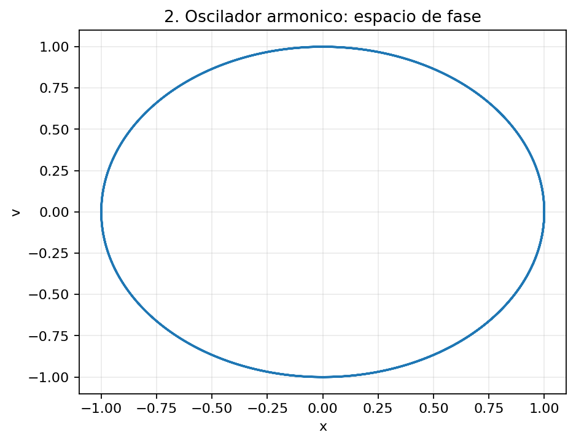
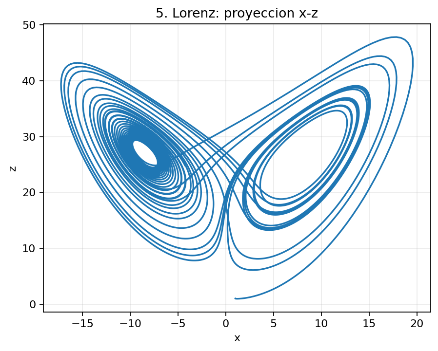

# rk4lab — Integrador Runge–Kutta 4 en Python

`rk4lab` es un proyecto didáctico para resolver numéricamente **ecuaciones diferenciales ordinarias (EDO)** mediante el método clásico de **Runge–Kutta de cuarto orden (RK4)**.

La idea central del proyecto es mantener completamente separadas tres partes:

```text
modelo matemático  ──────►  integrador RK4  ──────►  resultados
       │                                              │
       │                                              ├── gráficas
       │                                              ├── espacio de fase
       │                                              ├── sección de Poincaré
       │                                              └── análisis de convergencia
       │
       └── define F(t,Y,p)
```

El integrador **no necesita saber qué representa físicamente el problema**. Solo recibe una función que define

$$
\frac{d\mathbf Y}{dt}
=
\mathbf F(t,\mathbf Y,\mathbf p),
$$

junto con una condición inicial, un intervalo temporal y los parámetros del modelo.

Por eso el mismo código puede utilizarse para integrar:

- una EDO escalar;
- sistemas de EDO acopladas;
- ecuaciones lineales y no lineales;
- EDO de orden superior transformadas en sistemas de primer orden;
- sistemas con una o varias entradas externas;
- osciladores;
- sistemas dinámicos caóticos;
- y, posteriormente, modelos neuronales.

---

## 1. ¿Qué es un método de Runge–Kutta?

Consideremos un problema de valores iniciales

$$
\frac{dy}{dt}=f(t,y),
\qquad
y(t_0)=y_0.
$$

Queremos conocer aproximadamente la solución en una sucesión de tiempos

$$
t_n=t_0+nh,
$$

donde $h$ es el **paso de integración**.

Si conocemos aproximadamente

$$
y_n\simeq y(t_n),
$$

queremos construir una aproximación para

$$
y_{n+1}\simeq y(t_n+h).
$$

Los métodos de Runge–Kutta hacen esto evaluando la pendiente

$$
f(t,y)
$$

en distintos puntos dentro del intervalo de integración y combinando esas evaluaciones para estimar cuánto cambia la solución.

---

## 2. De Euler a RK4

Runge–Kutta no es un único algoritmo, sino una **familia de métodos**.

### 2.1 RK1 — método de Euler

El método de Runge–Kutta de primer orden coincide con el método de Euler.

Se calcula una única pendiente:

$$
k_1=f(t_n,y_n),
$$

y se avanza mediante

$$
y_{n+1}=y_n+h\,k_1.
$$

Por lo tanto,

$$
\boxed{
y_{n+1}=y_n+h\,f(t_n,y_n)
}
$$

Euler utiliza solamente la pendiente al comienzo del intervalo.

Es sencillo y rápido, pero su error global es de orden

$$
O(h).
$$

---

### 2.2 RK2 — método del punto medio

Una posibilidad de Runge–Kutta de segundo orden consiste en calcular primero

$$
k_1=f(t_n,y_n),
$$

usar esa pendiente para estimar el estado en el centro del intervalo,

$$
k_2=
f\left(
t_n+\frac h2,
y_n+\frac h2k_1
\right),
$$

y finalmente avanzar utilizando esa segunda pendiente:

$$
\boxed{
y_{n+1}=y_n+h\,k_2
}
$$

La idea es que una pendiente evaluada aproximadamente en el centro del intervalo proporciona una mejor estimación que utilizar únicamente la pendiente inicial.

---

## 3. Runge–Kutta clásico de cuarto orden

El método utilizado en este proyecto es el **Runge–Kutta clásico de cuarto orden**, normalmente llamado simplemente **RK4**.

Partiendo del estado

$$
(t_n,\mathbf Y_n),
$$

queremos avanzar hasta

$$
t_{n+1}=t_n+h.
$$

RK4 calcula cuatro pendientes.

### Primera pendiente

$$
\mathbf k_1
=
\mathbf F(t_n,\mathbf Y_n).
$$

Es la pendiente evaluada exactamente al comienzo del intervalo.

### Segunda pendiente

$$
\mathbf k_2
=
\mathbf F\left(
t_n+\frac h2,
\mathbf Y_n+\frac h2\mathbf k_1
\right).
$$

Con $\mathbf k_1$ estimamos dónde estaría el sistema a mitad del intervalo y evaluamos allí una nueva pendiente.

### Tercera pendiente

$$
\mathbf k_3
=
\mathbf F\left(
t_n+\frac h2,
\mathbf Y_n+\frac h2\mathbf k_2
\right).
$$

Se realiza una segunda estimación en el centro, ahora utilizando $\mathbf k_2$.

### Cuarta pendiente

$$
\mathbf k_4
=
\mathbf F\left(
t_n+h,
\mathbf Y_n+h\mathbf k_3
\right).
$$

Finalmente estimamos la pendiente al final del intervalo.

Las cuatro evaluaciones pueden visualizarse esquemáticamente como

```text
t_n                    t_n + h/2                    t_n + h
 │                         │                           │
 │                         │                           │
 k1                       k2                          k4
 │                         │
 │                        k3
 │
 └─────────────────────────────────────────────────────► t
```

La actualización final es

$$
\boxed{
\mathbf Y_{n+1}
=
\mathbf Y_n
+
\frac h6
\left(
\mathbf k_1
+
2\mathbf k_2
+
2\mathbf k_3
+
\mathbf k_4
\right)
}
$$

La combinación

$$
\frac{
\mathbf k_1+2\mathbf k_2+2\mathbf k_3+\mathbf k_4
}{6}
$$

puede interpretarse como un **promedio ponderado de las pendientes**.

Las dos evaluaciones realizadas en el centro del intervalo tienen peso doble.

> **Importante:** no se trata de una media geométrica. La combinación utilizada por RK4 es una combinación lineal ponderada.

---

## 4. RK4 funciona directamente con vectores

Una característica fundamental del algoritmo es que no cambia cuando la incógnita deja de ser un escalar y pasa a ser un vector.

Si tenemos

$$
\mathbf Y=
\begin{pmatrix}
y_1\\
y_2\\
\vdots\\
y_m
\end{pmatrix},
$$

podemos escribir el sistema como

$$
\boxed{
\frac{d\mathbf Y}{dt}
=
\mathbf F(t,\mathbf Y)
}
$$

con

$$
\mathbf F(t,\mathbf Y)
=
\begin{pmatrix}
f_1(t,\mathbf Y)\\
f_2(t,\mathbf Y)\\
\vdots\\
f_m(t,\mathbf Y)
\end{pmatrix}.
$$

Entonces

$$
\mathbf k_1,\quad
\mathbf k_2,\quad
\mathbf k_3,\quad
\mathbf k_4
$$

son simplemente vectores de la misma dimensión que $\mathbf Y$.

El algoritmo RK4 **no cambia**.

---

## 5. RK4 es un método explícito

Que $\mathbf Y$ sea un vector **no significa que haya que resolver un sistema algebraico en cada paso**.

En RK4 clásico las etapas se calculan secuencialmente:

```text
Y_n ──► k1 ──► k2 ──► k3 ──► k4 ──► Y_(n+1)
```

Cuando se calcula $\mathbf k_1$, todas las cantidades necesarias son conocidas.

Una vez conocido $\mathbf k_1$, se puede calcular $\mathbf k_2$.

Luego $\mathbf k_3$.

Luego $\mathbf k_4$.

Y finalmente $\mathbf Y_{n+1}$.

Por eso RK4 es un **método explícito**.

No hace falta utilizar Gauss–Seidel, inversión de matrices ni Newton–Raphson para ejecutar cada paso de RK4.

### Comparación con un método implícito

Euler implícito, por ejemplo, escribe

$$
\mathbf Y_{n+1}
=
\mathbf Y_n
+
h\,
\mathbf F(t_{n+1},\mathbf Y_{n+1}).
$$

Ahora $\mathbf Y_{n+1}$ aparece también dentro de $\mathbf F$.

Por ejemplo, para

$$
\dot{\mathbf Y}=A\mathbf Y,
$$

Euler implícito produce

$$
\mathbf Y_{n+1}
=
\mathbf Y_n+hA\mathbf Y_{n+1},
$$

por lo que

$$
\boxed{
(I-hA)\mathbf Y_{n+1}
=
\mathbf Y_n
}
$$

y efectivamente hay que resolver un sistema lineal.

Para un sistema no lineal podría aparecer una ecuación

$$
\mathbf G(\mathbf Y_{n+1})=0,
$$

que podría requerir, por ejemplo, Newton–Raphson.

Esto **no ocurre en RK4 clásico**.

---

## 6. Sistemas de ecuaciones diferenciales

Consideremos

$$
\begin{aligned}
\dot x &= f_1(t,x,y,z),\\
\dot y &= f_2(t,x,y,z),\\
\dot z &= f_3(t,x,y,z).
\end{aligned}
$$

Definimos

$$
\mathbf Y=
\begin{pmatrix}
x\\
y\\
z
\end{pmatrix},
$$

y

$$
\mathbf F(t,\mathbf Y)
=
\begin{pmatrix}
f_1(t,\mathbf Y)\\
f_2(t,\mathbf Y)\\
f_3(t,\mathbf Y)
\end{pmatrix}.
$$

Entonces todo el sistema queda escrito como

$$
\boxed{
\dot{\mathbf Y}
=
\mathbf F(t,\mathbf Y)
}
$$

y puede integrarse directamente con el mismo RK4.

---

## 7. EDO de orden superior

RK4 está formulado para sistemas de ecuaciones de **primer orden**.

Sin embargo, una EDO de orden superior puede transformarse en un sistema de EDO de primer orden.

### Ejemplo: oscilador armónico

Consideremos

$$
\ddot x+\omega^2x=0.
$$

Despejamos

$$
\ddot x=-\omega^2x.
$$

Definimos

$$
y_1=x,
\qquad
y_2=\dot x.
$$

Entonces

$$
\dot y_1=y_2,
$$

y

$$
\dot y_2=-\omega^2y_1.
$$

Por lo tanto,

$$
\boxed{
\frac{d}{dt}
\begin{pmatrix}
y_1\\
y_2
\end{pmatrix}
=
\begin{pmatrix}
y_2\\
-\omega^2y_1
\end{pmatrix}
}
$$

y el problema ya tiene exactamente la forma requerida por el integrador.

### Espacio de fase

Además de representar $x(t)$ y $v(t)$ por separado, podemos representar

$$
v(t)
\quad\text{contra}\quad
x(t).
$$

Esto produce una trayectoria en el **espacio de fase**.



*Figura 1 — Trayectoria del oscilador armónico en el espacio de fase $(x,v)$. Para el oscilador ideal, la trayectoria permanece cerrada.*

El ejemplo completo puede consultarse en [`ejemplos/02_oscilador_armonico.py`](ejemplos/02_oscilador_armonico.py).

---

## 8. Oscilador amortiguado y forzado

Una ecuación más general es

$$
\ddot x+\beta\dot x+\omega^2x=F(t).
$$

Despejando,

$$
\ddot x
=
F(t)-\beta\dot x-\omega^2x.
$$

Definimos nuevamente

$$
y_1=x,
\qquad
y_2=\dot x.
$$

Entonces

$$
\boxed{
\begin{aligned}
\dot y_1 &= y_2,\\
\dot y_2 &= F(t)-\beta y_2-\omega^2y_1.
\end{aligned}
}
$$

El hecho de que aparezca una función externa $F(t)$ no modifica el algoritmo RK4.

La entrada simplemente forma parte de la función que define el modelo.

---

## 9. Caso general de una EDO de orden \(m\)

Consideremos

$$
y^{(m)}
=
f
\left(
t,
y,
y',
y'',
\ldots,
y^{(m-1)}
\right).
$$

Definimos

$$
y_1=y,
\qquad
y_2=y',
\qquad
y_3=y'',
\qquad
\ldots,
\qquad
y_m=y^{(m-1)}.
$$

Entonces

$$
\begin{aligned}
\dot y_1 &= y_2,\\
\dot y_2 &= y_3,\\
&\vdots\\
\dot y_{m-1} &= y_m,\\
\dot y_m &= f(t,y_1,y_2,\ldots,y_m).
\end{aligned}
$$

Definiendo

$$
\mathbf Y=
\begin{pmatrix}
y_1\\
y_2\\
\vdots\\
y_m
\end{pmatrix},
$$

volvemos a obtener

$$
\boxed{
\dot{\mathbf Y}
=
\mathbf F(t,\mathbf Y)
}
$$

Por lo tanto, para el integrador:

> una EDO de cuarto orden convertida en cuatro EDO de primer orden y cuatro EDO originalmente acopladas son matemáticamente el mismo tipo de problema.

---

# 10. ¿Por qué RK4 se llama de cuarto orden?

El término **cuarto orden** no significa simplemente que RK4 utilice cuatro pendientes.

El orden indica cómo disminuye el error cuando reducimos el paso $h$.

La solución exacta puede desarrollarse alrededor de $t_n$:

$$
y(t_n+h)
=
y(t_n)
+
hy'(t_n)
+
\frac{h^2}{2!}y''(t_n)
+
\frac{h^3}{3!}y'''(t_n)
+
\frac{h^4}{4!}y^{(4)}(t_n)
+
O(h^5).
$$

Las cuatro pendientes de RK4 están elegidas de tal manera que, al desarrollar también las evaluaciones del método en serie de Taylor y combinarlas,

$$
y_{n+1}
=
y_n
+
\frac h6
(k_1+2k_2+2k_3+k_4),
$$

se reproducen exactamente todos los términos hasta orden $h^4$.

Por lo tanto,

$$
y(t_n+h)-y_{n+1}
=
O(h^5).
$$

Ese es el **error local de truncamiento**.

---

## 10.1 Error local

El error local responde a la pregunta:

> Si comienzo un paso exactamente sobre la solución verdadera, ¿qué error introduce ese único paso de RK4?

Para RK4,

$$
\boxed{
E_{\mathrm{local}}
=
O(h^5)
}
$$

Si dividimos el paso por dos,

$$
h\longrightarrow\frac h2,
$$

esperamos aproximadamente

$$
E_{\mathrm{local}}
\longrightarrow
\frac{E_{\mathrm{local}}}{2^5}.
$$

Es decir,

$$
\boxed{
\frac{E(h)}{E(h/2)}
\longrightarrow
32
}
$$

cuando $h$ es suficientemente pequeño y domina el error de discretización.

---

## 10.2 Error global

Para llegar desde $t_0$ hasta un tiempo final $T$ hacen falta aproximadamente

$$
N
=
\frac{T-t_0}{h}
$$

pasos.

Cada paso introduce un error de orden $h^5$.

De manera esquemática,

$$
E_{\mathrm{global}}
\sim
N\,O(h^5).
$$

Como

$$
N\sim\frac1h,
$$

resulta

$$
E_{\mathrm{global}}
\sim
\frac1h h^5
=
h^4.
$$

Por lo tanto,

$$
\boxed{
E_{\mathrm{global}}
=
O(h^4)
}
$$

y al dividir $h$ por dos esperamos aproximadamente

$$
\boxed{
\frac{E(h)}{E(h/2)}
\longrightarrow
16
}
$$

---

## 10.3 Verificación numérica del orden

Para comprobar que el integrador fue programado correctamente utilizamos una ecuación cuya solución exacta conocemos:

$$
\dot y=y,
\qquad
y(0)=1.
$$

Su solución exacta es

$$
y(t)=e^t.
$$

Integramos hasta un tiempo fijo $T$ utilizando distintos valores de $h$ y comparamos el resultado numérico con

$$
e^T.
$$


*Figura 2 — Estudio numérico de convergencia de RK4. Al disminuir el paso de integración, el error local tiende a comportarse como $h^5$ y el error global como $h^4$.*

El código utilizado para realizar esta prueba puede consultarse en [`ejemplos/06_convergencia.py`](ejemplos/06_convergencia.py).

---

# 11. Arquitectura del programa

El proyecto está organizado de forma que el **integrador sea independiente de los modelos físicos**.

La idea puede resumirse como

```text
                     ┌─────────────────────┐
                     │   modelo matemático │
                     │     F(t,Y,p)        │
                     └──────────┬──────────┘
                                │
                                ▼
                     ┌─────────────────────┐
                     │    integrador RK4   │
                     │                     │
                     │ paso_rk4()          │
                     │ resolver_rk4()      │
                     └──────────┬──────────┘
                                │
                                ▼
                     ┌─────────────────────┐
                     │     trayectoria     │
                     │      t , Y(t)       │
                     └──────────┬──────────┘
                                │
             ┌──────────────────┼──────────────────┐
             ▼                  ▼                  ▼
        series t            fase             Poincaré
             │                  │                  │
             └──────────────────┼──────────────────┘
                                ▼
                            análisis
```

El núcleo del integrador se encuentra en [`src/rk4lab/integradores.py`](src/rk4lab/integradores.py).

La función encargada de realizar **un único paso** es [`paso_rk4`](src/rk4lab/integradores.py).

La función encargada de repetir esos pasos para construir toda la trayectoria es [`resolver_rk4`](src/rk4lab/integradores.py).

---

# 12. Entradas externas

Un modelo puede depender de una entrada externa $u(t)$.

Por ejemplo,

$$
\dot{\mathbf Y}
=
\mathbf F(t,\mathbf Y,u(t)).
$$

Desde el punto de vista del integrador esto no representa ningún problema.

La entrada se evalúa cuando se evalúa $\mathbf F$.

---

## 12.1 Una entrada

Podemos tener, por ejemplo,

$$
u(t)=A\sin(\omega t).
$$

Entonces el modelo puede escribirse conceptualmente como

```python
def modelo(t, Y, parametros):
    u = entrada(t)
    ...
    return derivadas
```

El integrador sigue viendo únicamente una función

$$
\mathbf F(t,\mathbf Y).
$$

---

## 12.2 Varias entradas simultáneas

También pueden existir varias entradas:

$$
u_1(t),u_2(t),\ldots,u_m(t).
$$

Por ejemplo,

$$
\mathbf u(t)
=
\begin{pmatrix}
u_1(t)\\
u_2(t)
\end{pmatrix}.
$$

El modelo podría tener la forma

$$
\dot{\mathbf Y}
=
\mathbf F(t,\mathbf Y,\mathbf u(t)).
$$

Otra posibilidad es que las entradas se combinen:

$$
u_{\mathrm{total}}(t)
=
\sum_{j=1}^{m}u_j(t).
$$

Por eso, si posteriormente el trabajo práctico requiere **ocho potenciales o estímulos de entrada simultáneos**, no será necesario modificar el algoritmo RK4.

Solo habrá que definir cómo esas ocho entradas intervienen en el modelo neuronal.


*Figura 3 — Ejemplo de integración de un sistema sometido a dos señales de entrada. Las señales externas pertenecen al modelo, no al algoritmo RK4.*

El ejemplo correspondiente puede consultarse en [`ejemplos/04_dos_entradas.py`](ejemplos/04_dos_entradas.py).

---

# 13. Ejemplos incluidos

El proyecto incluye varios problemas diseñados para probar distintas capacidades del integrador.

## 13.1 EDO escalar

El caso más sencillo comprueba que RK4 funciona correctamente con una única variable.

Por ejemplo,

$$
\dot y=y.
$$

Sirve además porque conocemos exactamente

$$
y(t)=e^t.
$$

De esta manera podemos comparar directamente solución numérica y solución analítica.

---

## 13.2 Oscilador armónico

El oscilador

$$
\ddot x+\omega^2x=0
$$

permite comprobar:

- EDO de segundo orden;
- transformación a sistema de primer orden;
- estado vectorial;
- integración de dos variables;
- representación temporal;
- espacio de fase.


*Figura 4 — Espacio de fase del oscilador armónico.*

Código: [`ejemplos/02_oscilador_armonico.py`](ejemplos/02_oscilador_armonico.py).

---

## 13.3 Oscilador de Duffing

El oscilador de Duffing introduce una no linealidad:

$$
\ddot x
+
\delta\dot x
+
\alpha x
+
\beta x^3
=
\gamma\cos(\omega t).
$$

Definiendo

$$
y_1=x,
\qquad
y_2=\dot x,
$$

obtenemos

$$
\begin{aligned}
\dot y_1 &= y_2,\\
\dot y_2 &=
-\delta y_2
-\alpha y_1
-\beta y_1^3
+\gamma\cos(\omega t).
\end{aligned}
$$

Este ejemplo es especialmente importante porque muestra que **RK4 no requiere que las ecuaciones sean lineales**.


*Figura 5 — Trayectoria obtenida para el oscilador no lineal de Duffing.*

Código: [`ejemplos/03_duffing.py`](ejemplos/03_duffing.py).

---

## 13.4 Sistema con varias entradas

Este ejemplo comprueba que un mismo modelo puede recibir más de una señal externa.


*Figura 6 — Respuesta del sistema frente a dos entradas externas.*

Código: [`ejemplos/04_dos_entradas.py`](ejemplos/04_dos_entradas.py).

---

## 13.5 Sistema de Lorenz

El sistema de Lorenz está formado por tres EDO no lineales acopladas:

$$
\begin{aligned}
\dot x &= \sigma(y-x),\\
\dot y &= x(\rho-z)-y,\\
\dot z &= xy-\beta z.
\end{aligned}
$$

Este ejemplo comprueba simultáneamente que el integrador puede manejar:

- tres variables de estado;
- ecuaciones acopladas;
- términos no lineales;
- dinámica compleja.



*Figura 7 — Proyección de la trayectoria calculada para el sistema de Lorenz.*

Código: [`ejemplos/05_lorenz.py`](ejemplos/05_lorenz.py).

---

## 13.6 Test de convergencia

Utilizamos

$$
\dot y=y,
\qquad
y(0)=1,
\qquad
y(t)=e^t
$$

para comprobar experimentalmente el orden del método.


*Figura 8 — Comprobación numérica del comportamiento del error al reducir el paso de integración.*

Código: [`ejemplos/06_convergencia.py`](ejemplos/06_convergencia.py).

---

## 13.7 Un caso patológico: falta de unicidad

Consideremos

$$
\dot y=2\sqrt{y},
\qquad
y(0)=0.
$$

Este problema es interesante porque muestra algo importante:

> que un algoritmo numérico esté correctamente implementado no garantiza que el problema matemático tenga una solución única.

Una solución es

$$
y(t)=0.
$$

También existen soluciones que permanecen en cero hasta cierto tiempo y luego comienzan a crecer.

Este ejemplo permite separar dos cuestiones diferentes:

1. si el **integrador numérico** funciona correctamente;
2. si el **problema diferencial** está bien planteado y posee solución única.

Código: [`ejemplos/07_no_unicidad.py`](ejemplos/07_no_unicidad.py).

---

# 14. Gráficas y análisis de sistemas dinámicos

Una vez obtenida la trayectoria

$$
\mathbf Y(t),
$$

podemos analizarla de distintas maneras sin modificar el integrador.

---

## Series temporales

La representación más directa consiste en graficar cada componente:

$$
y_i(t).
$$

Esto será particularmente útil en modelos neuronales para representar, por ejemplo, un potencial de membrana en función del tiempo.

---

## Espacio de fase

Para un sistema con dos variables

$$
\mathbf Y=(x,v),
$$

podemos representar

$$
v\;\text{vs.}\;x.
$$


*Figura 9 — Ejemplo de representación en espacio de fase.*

---

## Sección de Poincaré

Para sistemas periódicamente forzados puede ser útil observar el sistema solamente cada período de excitación.

Si

$$
T_f=\frac{2\pi}{\omega_f},
$$

se toman estados aproximadamente en

$$
t_n=t_0+nT_f.
$$

En lugar de observar una trayectoria continua obtenemos un conjunto discreto de puntos.

Esto permite estudiar con mayor claridad:

- periodicidad;
- órbitas de período múltiple;
- cuasiperiodicidad;
- dinámica caótica.

La implementación correspondiente se encuentra en las herramientas de análisis del proyecto.

---

# 15. ¿Cómo se utiliza el integrador?

El patrón general consiste en definir primero el modelo.

Por ejemplo:

```python
import numpy as np

def modelo(t, Y, parametros):
    x, v = Y

    omega = parametros["omega"]

    dxdt = v
    dvdt = -(omega**2) * x

    return np.array([dxdt, dvdt], dtype=float)
```

Luego se especifican las condiciones iniciales:

```python
Y0 = np.array([1.0, 0.0])
```

los parámetros:

```python
parametros = {
    "omega": 1.0,
}
```

y finalmente se llama al integrador.

Conceptualmente:

```python
t, Y = resolver_rk4(
    modelo,
    t0,
    tf,
    Y0,
    h,
    parametros,
)
```

La salida contiene los tiempos

$$
t_0,t_1,\ldots,t_N
$$

y los correspondientes estados

$$
\mathbf Y_0,\mathbf Y_1,\ldots,\mathbf Y_N.
$$

---

# 16. Qué debe hacer el integrador y qué no

Una decisión importante del diseño es evitar que el integrador acumule responsabilidades que corresponden al modelo o al análisis.

El integrador debe encargarse de:

```text
F(t,Y,p)
   │
   ▼
┌─────────────┐
│    RK4      │
└──────┬──────┘
       │
       ▼
   t , Y(t)
```

No debería saber:

- si $Y$ representa posición;
- si representa velocidad;
- si representa voltaje;
- si representa variables neuronales;
- cuántas señales externas existen;
- qué variable queremos graficar;
- si queremos construir una sección de Poincaré.

Eso pertenece a otras capas del programa.

Esta separación permite reutilizar exactamente el mismo RK4 en problemas completamente diferentes.

---

# 17. Relación con el futuro modelo neuronal

La motivación final del proyecto es utilizar el integrador con ecuaciones que modelen dinámica neuronal.

Un modelo neuronal podría tener, esquemáticamente,

$$
\mathbf Y=
\begin{pmatrix}
V\\
w_1\\
w_2\\
\vdots
\end{pmatrix},
$$

donde $V$ podría representar un potencial y las demás variables otros grados de libertad internos del modelo.

La dinámica tendría alguna forma

$$
\dot{\mathbf Y}
=
\mathbf F
\left(
t,
\mathbf Y,
\mathbf u(t),
\mathbf p
\right),
$$

donde

$$
\mathbf u(t)
=
\begin{pmatrix}
u_1(t)\\
u_2(t)\\
\vdots\\
u_m(t)
\end{pmatrix}
$$

representaría una o varias entradas.

La arquitectura desarrollada permite entonces mantener separados:

```text
                   entradas
                u1(t),...,um(t)
                       │
                       ▼
                ┌─────────────┐
                │   modelo    │
                │  neuronal   │
                └──────┬──────┘
                       │
                  F(t,Y,p)
                       │
                       ▼
                ┌─────────────┐
                │     RK4     │
                └──────┬──────┘
                       │
                     Y(t)
                       │
          ┌────────────┼────────────┐
          ▼            ▼            ▼
       potencial     fase        análisis
```

Por lo tanto, si el trabajo práctico finalmente solicita:

- un potencial de entrada;
- varios potenciales de entrada;
- ocho entradas simultáneas;
- ocho experimentos diferentes;
- uno o varios potenciales de salida;
- comparación entre entrada y salida;

el núcleo RK4 **no debería necesitar modificaciones**.

Lo que cambiará será el modelo y la forma de analizar o representar los resultados.

---

# 18. Estructura conceptual del proyecto

```text
rk4/
│
├── src/
│   └── rk4lab/
│       ├── integradores.py
│       ├── modelos/
│       ├── entradas/
│       ├── analisis/
│       └── graficos/
│
├── ejemplos/
│   ├── 01_edo_escalar.py
│   ├── 02_oscilador_armonico.py
│   ├── 03_duffing.py
│   ├── 04_dos_entradas.py
│   ├── 05_lorenz.py
│   ├── 06_convergencia.py
│   └── 07_no_unicidad.py
│
├── figuras/
│   ├── 02_oscilador_fase.png
│   ├── 03_duffing.png
│   ├── 04_dos_entradas.png
│   ├── 05_lorenz.png
│   └── 06_convergencia.png
│
├── tests/
│
└── README.md
```

La separación fundamental es

```text
MODELO  ≠  INTEGRADOR  ≠  ANÁLISIS  ≠  GRÁFICOS
```

Esta estructura permite incorporar nuevos modelos sin tocar el algoritmo RK4.

---

# 19. Tests que debería superar el proyecto

Antes de utilizar el integrador con un modelo neuronal desconocido conviene comprobarlo con problemas cuyo comportamiento ya conocemos.

Los ejemplos anteriores permiten probar progresivamente:

| Problema | Escalar | Vectorial | No lineal | Entrada externa | Solución conocida |
|---|:---:|:---:|:---:|:---:|:---:|
| $\dot y=y$ | ✓ | | | | ✓ |
| Oscilador armónico | | ✓ | | | ✓ |
| Oscilador forzado | | ✓ | | ✓ | |
| Duffing | | ✓ | ✓ | ✓ | |
| Dos entradas | | ✓ | | ✓✓ | |
| Lorenz | | ✓ | ✓ | | |
| Convergencia | ✓ | | | | ✓ |

De esta forma, cuando el integrador se utilice posteriormente para el trabajo práctico, tendremos evidencia independiente de que el núcleo numérico funciona correctamente.

---

# 20. Idea central

Todo el proyecto puede resumirse en una sola ecuación:

$$
\boxed{
\dot{\mathbf Y}
=
\mathbf F(t,\mathbf Y,\mathbf p)
}
$$

RK4 no necesita saber qué significa $\mathbf Y$.

Puede representar

$$
\mathbf Y=
\begin{pmatrix}
x\\
v
\end{pmatrix},
$$

o

$$
\mathbf Y=
\begin{pmatrix}
x\\
y\\
z
\end{pmatrix},
$$

o eventualmente

$$
\mathbf Y=
\begin{pmatrix}
V\\
w_1\\
w_2\\
\vdots
\end{pmatrix}.
$$

Mientras el modelo pueda proporcionar

$$
\mathbf F(t,\mathbf Y,\mathbf p),
$$

el mismo integrador puede avanzar el sistema mediante

$$
\boxed{
\mathbf Y_{n+1}
=
\mathbf Y_n
+
\frac h6
\left(
\mathbf k_1
+
2\mathbf k_2
+
2\mathbf k_3
+
\mathbf k_4
\right)
}
$$

con

$$
\begin{aligned}
\mathbf k_1
&=
\mathbf F(t_n,\mathbf Y_n),\\[4pt]
\mathbf k_2
&=
\mathbf F\left(
t_n+\frac h2,
\mathbf Y_n+\frac h2\mathbf k_1
\right),\\[4pt]
\mathbf k_3
&=
\mathbf F\left(
t_n+\frac h2,
\mathbf Y_n+\frac h2\mathbf k_2
\right),\\[4pt]
\mathbf k_4
&=
\mathbf F\left(
t_n+h,
\mathbf Y_n+h\mathbf k_3
\right).
\end{aligned}
$$

Ese es el objetivo del diseño: que **el modelo cambie, pero el integrador no**.
