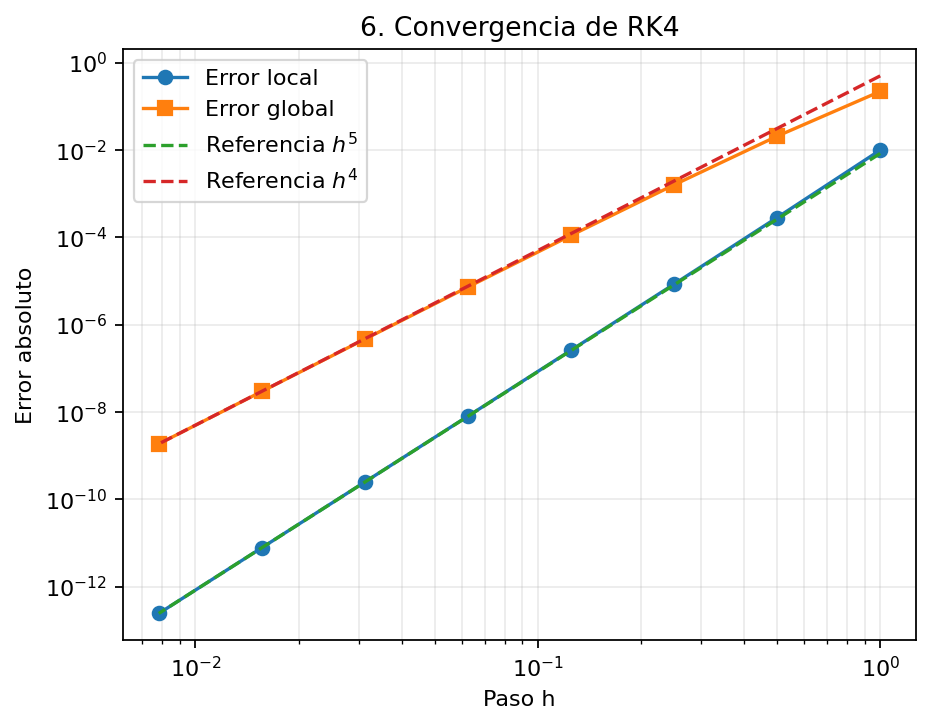
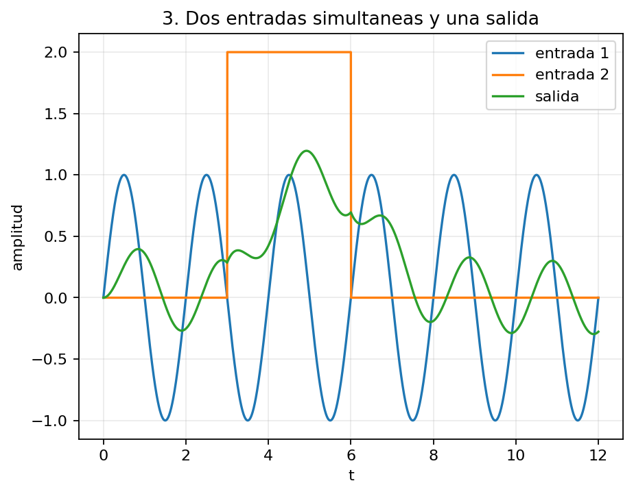

# rk4lab — Integrador Runge–Kutta 4 en Python

`rk4lab` es un proyecto didáctico y reutilizable para resolver **problemas de valores iniciales de ecuaciones diferenciales ordinarias (EDO)** mediante el método clásico de **Runge–Kutta de cuarto orden (RK4)**.

Está pensado como base para los trabajos prácticos de **Fundamentos de Redes Neuronales — FAMAF 2026**, pero el núcleo numérico es completamente general: no necesita saber qué representa físicamente el problema, sino solamente evaluar una función de la forma

$$\frac{d\mathbf Y}{dt}=\mathbf F(t,\mathbf Y,\mathbf p).$$

La idea del proyecto es separar claramente el **modelo matemático**, el **integrador**, los **resultados** y las herramientas de **análisis y visualización**:

```text
modelo matemático ──► integrador RK4 ──► solución Y(t)
       │                                     │
       │                                     ├── series temporales
       │                                     ├── espacio de fase
       │                                     ├── sección de Poincaré
       │                                     └── análisis de convergencia
       │
       └── define F(t,Y,p)
```

Por eso el mismo integrador puede utilizarse para una EDO escalar, un sistema acoplado, una EDO de orden superior transformada a primer orden, ecuaciones no lineales y modelos con una o varias entradas externas.

---

## Índice

- [1. Runge–Kutta: idea general](#1-rungekutta-idea-general)
- [2. De Euler a RK4](#2-de-euler-a-rk4)
- [3. RK4 clásico](#3-rk4-clásico)
- [4. RK4 vectorial](#4-rk4-vectorial)
- [5. RK4 es explícito](#5-rk4-es-explícito)
- [6. EDO de orden superior](#6-edo-de-orden-superior)
- [7. Error local, error global y orden](#7-error-local-error-global-y-orden)
- [8. Arquitectura del proyecto](#8-arquitectura-del-proyecto)
- [9. Instalación y uso](#9-instalación-y-uso)
- [10. Entradas externas](#10-entradas-externas)
- [11. Problemas de prueba incluidos](#11-problemas-de-prueba-incluidos)
- [12. Alcance y limitaciones](#12-alcance-y-limitaciones)
- [13. Preparación para el TP neuronal](#13-preparación-para-el-tp-neuronal)

---

## 1. Runge–Kutta: idea general

Consideremos el problema de valores iniciales

$$\frac{dy}{dt}=f(t,y),\qquad y(t_0)=y_0.$$

Queremos aproximar la solución en una sucesión de tiempos

$$t_n=t_0+nh,$$

donde $h$ es el **paso de integración**.

Si conocemos aproximadamente

$$y_n\simeq y(t_n),$$

queremos construir una aproximación para

$$y_{n+1}\simeq y(t_n+h).$$

Los métodos de Runge–Kutta hacen esto evaluando la pendiente $f(t,y)$ en uno o varios puntos del intervalo de integración y combinando esas evaluaciones para estimar la evolución de la solución.

> **Runge–Kutta no es un único método:** es una familia de métodos. RK1, RK2, RK3, RK4, etc. son miembros diferentes de esa familia.

---

## 2. De Euler a RK4

### 2.1 RK1 — método de Euler explícito

El método de Euler explícito puede interpretarse como un **Runge–Kutta de primer orden (RK1)**.

Se calcula una sola pendiente:

$$k_1=f(t_n,y_n),$$

y se avanza mediante

$$\boxed{y_{n+1}=y_n+h\,k_1}.$$

Equivalente a

$$\boxed{y_{n+1}=y_n+h\,f(t_n,y_n)}.$$

Euler utiliza solamente la pendiente al comienzo del intervalo y tiene error global de orden $O(h)$.

### 2.2 RK2 — método del punto medio

Una forma habitual de RK2 calcula

$$k_1=f(t_n,y_n),$$

$$k_2=f\left(t_n+\frac h2,y_n+\frac h2k_1\right),$$

y avanza con

$$\boxed{y_{n+1}=y_n+h\,k_2}.$$

La idea es utilizar una pendiente estimada aproximadamente en el centro del intervalo en lugar de depender únicamente de la pendiente inicial.

---

## 3. RK4 clásico

El método utilizado en este proyecto es el **Runge–Kutta clásico de cuarto orden**.

Partimos del estado $(t_n,\mathbf Y_n)$ y queremos avanzar hasta

$$t_{n+1}=t_n+h.$$

RK4 calcula cuatro pendientes.

### Primera pendiente

$$\mathbf k_1=\mathbf F(t_n,\mathbf Y_n).$$

Se evalúa al comienzo del intervalo.

### Segunda pendiente

$$\mathbf k_2=\mathbf F\left(t_n+\frac h2,\mathbf Y_n+\frac h2\mathbf k_1\right).$$

Con $\mathbf k_1$ se estima el estado a mitad del intervalo y allí se evalúa una nueva pendiente.

### Tercera pendiente

$$\mathbf k_3=\mathbf F\left(t_n+\frac h2,\mathbf Y_n+\frac h2\mathbf k_2\right).$$

Se realiza una segunda estimación en el centro, ahora utilizando $\mathbf k_2$.

### Cuarta pendiente

$$\mathbf k_4=\mathbf F\left(t_n+h,\mathbf Y_n+h\mathbf k_3\right).$$

Se estima la pendiente al final del intervalo.

Finalmente,

$$\boxed{\mathbf Y_{n+1}=\mathbf Y_n+\frac h6\left(\mathbf k_1+2\mathbf k_2+2\mathbf k_3+\mathbf k_4\right)}.$$

La combinación

$$\frac{\mathbf k_1+2\mathbf k_2+2\mathbf k_3+\mathbf k_4}{6}$$

es una **media aritmética ponderada de las pendientes**. Las dos evaluaciones realizadas aproximadamente en el centro del intervalo tienen peso doble.

La implementación está en [`src/rk4lab/integradores.py`](src/rk4lab/integradores.py):

- [`paso_rk4`](src/rk4lab/integradores.py#L23-L39) realiza un único paso;
- [`resolver_rk4`](src/rk4lab/integradores.py#L42-L71) repite esos pasos para construir toda la trayectoria.

---

## 4. RK4 vectorial

El algoritmo no cambia cuando la incógnita deja de ser un escalar y pasa a ser un vector.

Si

$$\mathbf Y=\begin{pmatrix}y_1\\y_2\\\vdots\\y_m\end{pmatrix},$$

podemos escribir un sistema de EDO como

$$\boxed{\frac{d\mathbf Y}{dt}=\mathbf F(t,\mathbf Y)}$$

con

$$\mathbf F(t,\mathbf Y)=\begin{pmatrix}f_1(t,\mathbf Y)\\f_2(t,\mathbf Y)\\\vdots\\f_m(t,\mathbf Y)\end{pmatrix}.$$

Cada $\mathbf k_i$ es entonces un vector de la misma dimensión que $\mathbf Y$.

En NumPy, el núcleo de RK4 se traduce casi literalmente:

```python
k1 = F(t, Y)
k2 = F(t + h/2, Y + h*k1/2)
k3 = F(t + h/2, Y + h*k2/2)
k4 = F(t + h,   Y + h*k3)

Y_nuevo = Y + h*(k1 + 2*k2 + 2*k3 + k4)/6
```

### Sistema lineal matricial

Si el modelo tiene la forma

$$\dot{\mathbf Y}=A\mathbf Y+B\mathbf u(t),$$

la función puede implementarse como

```python
def modelo(t, Y, parametros):
    A = parametros["A"]
    B = parametros["B"]
    u = parametros["entrada"](t)
    return A @ Y + B @ u
```

La estructura matricial pertenece al **modelo**. El algoritmo RK4 no cambia.

### Sistema no lineal

Por ejemplo,

$$\dot x=y-x^3,\qquad \dot y=\sin(x)-xy,$$

puede escribirse como

```python
def modelo(t, Y, parametros):
    x, y = Y
    return np.array([
        y - x**3,
        np.sin(x) - x*y,
    ])
```

Nuevamente, el integrador es exactamente el mismo.

---

## 5. RK4 es explícito

Que $\mathbf Y$ sea un vector **no significa que haya que resolver un sistema algebraico en cada paso**.

En RK4 las etapas se calculan secuencialmente:

```text
Y_n ──► k1 ──► k2 ──► k3 ──► k4 ──► Y_(n+1)
```

Cuando se calcula $\mathbf k_1$, todas las cantidades necesarias son conocidas. Con $\mathbf k_1$ se construye el estado intermedio para $\mathbf k_2$, luego se obtiene $\mathbf k_3$, después $\mathbf k_4$ y finalmente $\mathbf Y_{n+1}$.

Por eso el RK4 clásico es un **método explícito**.

Por ejemplo, para

$$\mathbf Y=\begin{pmatrix}x\\v\end{pmatrix},\qquad \mathbf F(t,\mathbf Y)=\begin{pmatrix}v\\-\omega^2x\end{pmatrix},$$

la primera etapa es simplemente

$$\mathbf k_1=\begin{pmatrix}v_n\\-\omega^2x_n\end{pmatrix}.$$

No hay incógnitas nuevas que despejar. Por eso no hace falta utilizar Gauss–Seidel, inversión de matrices ni Newton–Raphson para ejecutar cada paso de RK4.

### Contraste con un método implícito

Euler implícito escribe

$$\mathbf Y_{n+1}=\mathbf Y_n+h\mathbf F(t_{n+1},\mathbf Y_{n+1}).$$

Aquí $\mathbf Y_{n+1}$ aparece dentro de $\mathbf F$.

Si

$$\dot{\mathbf Y}=A\mathbf Y,$$

entonces

$$\mathbf Y_{n+1}=\mathbf Y_n+hA\mathbf Y_{n+1},$$

y por tanto

$$\boxed{(I-hA)\mathbf Y_{n+1}=\mathbf Y_n}.$$

Ahora sí aparece un sistema algebraico lineal que debe resolverse.

Si el problema fuera no lineal, podría aparecer una ecuación del tipo

$$\mathbf G(\mathbf Y_{n+1})=0,$$

y allí podría utilizarse, por ejemplo, Newton–Raphson.

---

## 6. EDO de orden superior

RK4 se formula para sistemas de EDO de primer orden. Una EDO de orden superior se transforma introduciendo variables auxiliares.

### 6.1 Oscilador armónico

Consideremos

$$\ddot x+\omega^2x=0.$$

Definimos

$$y_1=x,\qquad y_2=\dot x=v.$$

Entonces

$$\dot y_1=y_2,\qquad \dot y_2=-\omega^2y_1.$$

Por tanto,

$$\boxed{\frac{d}{dt}\begin{pmatrix}y_1\\y_2\end{pmatrix}=\begin{pmatrix}y_2\\-\omega^2y_1\end{pmatrix}}.$$

El modelo utilizado en el proyecto se encuentra en [`oscilador_armonico`](src/rk4lab/modelos.py#L17-L22).


*Figura 1 — Trayectoria del oscilador armónico en el espacio de fase $(x,v)$. El ejemplo comprueba que una EDO de segundo orden puede integrarse con el mismo RK4 después de transformarla en un sistema de primer orden.*

### 6.2 Oscilador amortiguado y forzado

Para

$$\ddot x+\beta\dot x+\omega^2x=F(t),$$

se define nuevamente $y_1=x$ y $y_2=\dot x$, obteniendo

$$\dot y_1=y_2,\qquad \dot y_2=F(t)-\beta y_2-\omega^2y_1.$$

El término externo $F(t)$ forma parte del modelo y no modifica el algoritmo RK4.

### 6.3 Caso general de orden $m$

Si

$$y^{(m)}=f\left(t,y,y',y'',\ldots,y^{(m-1)}\right),$$

se define

$$y_1=y,\qquad y_2=y',\qquad y_3=y'',\qquad\ldots,\qquad y_m=y^{(m-1)}.$$

Entonces

$$\dot y_1=y_2,\qquad \dot y_2=y_3,\qquad\ldots,\qquad \dot y_{m-1}=y_m,\qquad \dot y_m=f(t,y_1,y_2,\ldots,y_m).$$

Definiendo

$$\mathbf Y=\begin{pmatrix}y_1\\y_2\\\vdots\\y_m\end{pmatrix},$$

volvemos a obtener

$$\boxed{\dot{\mathbf Y}=\mathbf F(t,\mathbf Y)}.$$

Para el integrador, una EDO de cuarto orden convertida en cuatro ecuaciones y cuatro EDO originalmente acopladas son el mismo tipo de problema numérico.

---

## 7. Error local, error global y orden

El nombre **cuarto orden** no significa que RK4 tenga cuatro decimales correctos ni se debe simplemente a que utilice cuatro pendientes.

El orden describe cómo disminuye el error cuando reducimos el paso de integración $h$.

La solución exacta admite un desarrollo de Taylor:

$$y(t+h)=y(t)+hy'(t)+\frac{h^2}{2!}y''(t)+\frac{h^3}{3!}y'''(t)+\frac{h^4}{4!}y^{(4)}(t)+O(h^5).$$

Al desarrollar también las etapas de RK4 y sustituirlas en la combinación final, el método reproduce los términos de Taylor hasta orden $h^4$. La primera discrepancia aparece en orden $h^5$.

Para verificar este comportamiento utilizamos el problema

$$\dot y=y,\qquad y(0)=1,$$

cuya solución exacta es

$$y(t)=e^t.$$

Esto permite calcular directamente el error cometido por el integrador para diferentes valores del paso $h$.

### 7.1 Verificación general de convergencia

El experimento se realiza reduciendo sucesivamente

$$h,\qquad \frac h2,\qquad \frac h4,\qquad \frac h8,\qquad\ldots$$

y midiendo dos errores diferentes:

- **error local:** error producido por un único paso iniciado desde el valor exacto;
- **error global:** error después de integrar desde $t_0$ hasta un mismo tiempo final $T$.



*Figura 2 — Estudio general de convergencia del método RK4. En escala log-log, el error local sigue el comportamiento esperado proporcional a $h^5$, mientras que el error global sigue un comportamiento proporcional a $h^4$.*

Esta figura constituye una de las principales verificaciones del proyecto: no solamente muestra que la solución numérica se aproxima a la solución exacta, sino que **el error disminuye con las potencias de $h$ características del método RK4**.

---

### 7.2 Error local: orden 5

El **error local de truncamiento** responde a la pregunta:

> Si comienzo un único paso exactamente sobre la solución verdadera, ¿qué error introduce ese paso de RK4?

Para RK4,

$$\boxed{E_{\mathrm{local}}=O(h^5)}.$$

Para el problema $\dot y=y$, partimos siempre de $y(0)=1$ exacto, realizamos un solo paso de tamaño $h$ y calculamos

$$E_{\mathrm{local}}(h)=\left|y_{\mathrm{RK4}}(h)-e^h\right|.$$

Si

$$E_{\mathrm{local}}(h)\approx C_Lh^5,$$

entonces

$$\log E_{\mathrm{local}}\approx\log C_L+5\log h.$$

Por lo tanto, en una representación log-log esperamos obtener una recta de pendiente aproximadamente igual a 5.


*Figura 3 — Error local de RK4 en función del paso $h$. La referencia proporcional a $h^5$ permite verificar visualmente el orden local del método.*

Al reducir el paso a la mitad,

$$\frac{E_{\mathrm{local}}(h)}{E_{\mathrm{local}}(h/2)}\longrightarrow2^5=32.$$

Por lo tanto, dentro del régimen asintótico, dividir $h$ por dos reduce aproximadamente **32 veces** el error producido por un único paso.

---

### 7.3 Error global: orden 4

El **error global** mide la diferencia entre la solución numérica y la solución exacta después de avanzar mediante muchos pasos desde el dato inicial.

Para llegar desde $t_0$ hasta un tiempo final fijo $T$, se requieren aproximadamente

$$N=\frac{T-t_0}{h}$$

pasos.

Como intuición, si cada paso introduce un error local de orden $h^5$,

$$E_{\mathrm{global}}\sim N\,O(h^5)\sim\frac1hO(h^5)=O(h^4).$$

Por lo tanto,

$$\boxed{E_{\mathrm{global}}=O(h^4)}.$$

En el experimento numérico se integra siempre hasta $T=3$ y se calcula

$$E_{\mathrm{global}}(h)=\left|y_{\mathrm{RK4}}(3)-e^3\right|.$$

Si

$$E_{\mathrm{global}}(h)\approx C_Gh^4,$$

entonces

$$\log E_{\mathrm{global}}\approx\log C_G+4\log h,$$

por lo que esperamos una recta de pendiente aproximadamente igual a 4.


*Figura 4 — Error global de RK4 al integrar hasta un mismo tiempo final $T$. La referencia proporcional a $h^4$ evidencia el comportamiento esperado para un método de cuarto orden.*

Al reducir el paso a la mitad,

$$\frac{E_{\mathrm{global}}(h)}{E_{\mathrm{global}}(h/2)}\longrightarrow2^4=16.$$

Por lo tanto, en el régimen asintótico, dividir $h$ por dos reduce aproximadamente **16 veces** el error global.

---

### 7.4 Orden observado

El orden puede calcularse directamente a partir de dos errores consecutivos:

$$\boxed{p_{\mathrm{obs}}=\log_2\left(\frac{E(h)}{E(h/2)}\right)}.$$

Para RK4 esperamos

$$p_{\mathrm{local}}\longrightarrow5,\qquad p_{\mathrm{global}}\longrightarrow4.$$


*Figura 5 — Orden observado al reducir progresivamente el paso $h$. El orden local converge hacia 5 y el orden global hacia 4.*

Esta comprobación es más fuerte que verificar únicamente que la solución numérica “se parece” a la solución exacta: permite comprobar experimentalmente que la implementación posee el **orden de convergencia característico del RK4 clásico**.

El cálculo se encuentra en [`src/rk4lab/analisis.py`](src/rk4lab/analisis.py) y el experimento completo en [`examples/ejecutar_ejemplos.py`](examples/ejecutar_ejemplos.py).
## 8. Arquitectura del proyecto

```text
rk4/
├── README.md
├── pyproject.toml
├── examples/
│   └── ejecutar_ejemplos.py
├── figuras/
│   ├── 01_decaimiento_exponencial.png
│   ├── 02_oscilador_fase.png
│   ├── 03_dos_entradas.png
│   ├── 04_duffing_poincare.png
│   ├── 05_lorenz.png
│   ├── 06_convergencia_rk4.png
│   ├── 06a_error_local_orden5.png
│   ├── 06b_error_global_orden4.png
│   └── 06c_orden_observado.png
├── src/
│   └── rk4lab/
│       ├── __init__.py
│       ├── integradores.py
│       ├── modelos.py
│       ├── senales.py
│       ├── analisis.py
│       └── graficos.py
└── tests/
    └── test_rk4.py
```

La separación es intencional:

- [`integradores.py`](src/rk4lab/integradores.py): núcleo RK4 y objeto `Solucion`;
- [`modelos.py`](src/rk4lab/modelos.py): ecuaciones diferenciales de prueba;
- [`senales.py`](src/rk4lab/senales.py): entradas externas reutilizables;
- [`analisis.py`](src/rk4lab/analisis.py): Poincaré, errores y órdenes observados;
- [`graficos.py`](src/rk4lab/graficos.py): visualización de soluciones y convergencia;
- [`ejecutar_ejemplos.py`](examples/ejecutar_ejemplos.py): ejecuta todos los problemas y genera las figuras;
- [`test_rk4.py`](tests/test_rk4.py): tests automáticos.

La filosofía es mantener separadas las responsabilidades de **modelar**, **integrar**, **analizar** y **visualizar**.

---

## 9. Instalación y uso

Desde `practicos/integradores/rk4/`:

```bash
python -m venv .venv
source .venv/bin/activate
pip install -e '.[dev]'
```

En Windows PowerShell:

```powershell
.venv\Scripts\Activate.ps1
```

### Ejecutar tests

```bash
pytest -q
```

### Ejecutar los ejemplos y regenerar las figuras

```bash
python examples/ejecutar_ejemplos.py
```

### Uso mínimo

Todo modelo debe respetar la interfaz

```python
def modelo(t, y, parametros):
    return derivadas
```

Por ejemplo, para

$$\dot y=-2y,\qquad y(0)=1,$$

puede escribirse

```python
import numpy as np
from rk4lab.integradores import resolver_rk4


def modelo(t, y, parametros):
    return np.array([-2.0 * y[0]])


solucion = resolver_rk4(
    funcion=modelo,
    intervalo_t=(0, 5),
    y0=[1.0],
    dt=0.01,
    parametros={},
    nombres=["y"],
)

print(solucion.t)
print(solucion.y[:, 0])
```

`solucion.t` contiene los tiempos y `solucion.y` tiene forma

```text
(numero_de_tiempos, numero_de_variables)
```

Por lo tanto, `solucion.y[:, 0]` representa la evolución temporal de la primera componente.

---

## 10. Entradas externas

Las entradas externas se representan como funciones del tiempo y pertenecen al modelo, no al integrador.

El módulo [`senales.py`](src/rk4lab/senales.py) incluye señales constantes, sinusoidales, pulsos y sumas de señales.

Por ejemplo,

```python
from rk4lab.senales import sinusoidal, pulso

entrada_1 = sinusoidal(amplitud=1.0, frecuencia=0.5)
entrada_2 = pulso(amplitud=2.0, t_inicio=3.0, t_fin=6.0)
```

Un modelo con dos entradas simultáneas puede escribirse como

$$\dot y=-ay+b_1u_1(t)+b_2u_2(t).$$

En Python:

```python
def modelo(t, y, p):
    u1 = p["entrada1"](t)
    u2 = p["entrada2"](t)

    return np.array([
        -p["a"]*y[0]
        + p["b1"]*u1
        + p["b2"]*u2
    ])
```

La cantidad de entradas no modifica RK4. Si el futuro TP requiere 1, 2 u 8 entradas, esa información pertenece al modelo.



*Figura 5 — Una variable de estado sometida simultáneamente a una entrada sinusoidal y un pulso. El integrador solamente evalúa la derivada resultante.*

Modelo: [`sistema_lineal_dos_entradas`](src/rk4lab/modelos.py#L25-L33). Ejecución: [`examples/ejecutar_ejemplos.py`](examples/ejecutar_ejemplos.py#L46-L59).

---

## 11. Problemas de prueba incluidos

Los problemas incluidos no están pensados solamente como ejemplos visuales: cada uno comprueba una propiedad distinta del integrador.

### 11.1 Decaimiento exponencial

Se resuelve

$$\dot y=-\lambda y,\qquad y(0)=1,$$

con solución exacta, para $\lambda=1$,

$$y(t)=e^{-t}.$$

Permite comparar directamente el resultado numérico contra una solución conocida.

Modelo: [`decaimiento_exponencial`](src/rk4lab/modelos.py#L11-L14). Ejecución: [`examples/ejecutar_ejemplos.py`](examples/ejecutar_ejemplos.py#L31-L37).

### 11.2 Oscilador armónico

Comprueba una EDO de segundo orden transformada a sistema vectorial de primer orden.

Modelo: [`oscilador_armonico`](src/rk4lab/modelos.py#L17-L22). Ejecución: [`examples/ejecutar_ejemplos.py`](examples/ejecutar_ejemplos.py#L39-L44).

### 11.3 Dos entradas simultáneas

Comprueba que las entradas externas pertenecen al modelo y que varias señales pueden actuar simultáneamente sin modificar el núcleo RK4.

Modelo: [`sistema_lineal_dos_entradas`](src/rk4lab/modelos.py#L25-L33). Ejecución: [`examples/ejecutar_ejemplos.py`](examples/ejecutar_ejemplos.py#L46-L59).

### 11.4 Duffing forzado y sección de Poincaré

El oscilador de Duffing introduce no linealidad:

$$\ddot x+\delta\dot x+\alpha x+\beta x^3=F(t).$$

Transformado a primer orden:

$$\dot x=v,\qquad \dot v=-\delta v-\alpha x-\beta x^3+F(t).$$

Además de integrar la trayectoria, se construye una sección de Poincaré muestreando el sistema una vez por período del forzado después de descartar un transitorio.

Modelo: [`duffing`](src/rk4lab/modelos.py#L36-L43). Análisis: [`seccion_poincare`](src/rk4lab/analisis.py#L6-L16). Ejecución: [`examples/ejecutar_ejemplos.py`](examples/ejecutar_ejemplos.py#L61-L70).

### 11.5 Sistema de Lorenz

Se integra

$$\dot x=\sigma(y-x),\qquad \dot y=x(\rho-z)-y,\qquad \dot z=xy-\beta z.$$

Comprueba que el mismo RK4 funciona con tres variables acopladas y términos no lineales.

Modelo: [`lorenz`](src/rk4lab/modelos.py#L46-L56). Ejecución: [`examples/ejecutar_ejemplos.py`](examples/ejecutar_ejemplos.py#L72-L76).

### 11.6 Convergencia de RK4

El problema

$$\dot y=y,\qquad y(0)=1,\qquad y(t)=e^t$$

se utiliza para demostrar experimentalmente el orden local 5 y el orden global 4.

Las tres gráficas principales de este README provienen de este ejemplo:

- [`06a_error_local_orden5.png`](figuras/06a_error_local_orden5.png);
- [`06b_error_global_orden4.png`](figuras/06b_error_global_orden4.png);
- [`06c_orden_observado.png`](figuras/06c_orden_observado.png).

Ejecución: [`examples/ejecutar_ejemplos.py`](examples/ejecutar_ejemplos.py#L78-L110).

### 11.7 Problema sin unicidad

Consideremos

$$\dot y=2\sqrt y,\qquad y(0)=0.$$

Una solución es

$$y(t)=0,$$

y para $t\ge0$ también

$$y(t)=t^2$$

satisface la ecuación con la misma condición inicial. Existen además soluciones que permanecen un tiempo en cero antes de comenzar a crecer.

Si RK4 comienza exactamente en $y_0=0$,

$$k_1=k_2=k_3=k_4=0,$$

y permanece en $y=0$ aunque se reduzca $h$.

Esto no es un fallo del integrador: el problema de valores iniciales no posee unicidad.

Modelo: [`raiz_no_unica`](src/rk4lab/modelos.py#L66-L68). Ejecución: [`examples/ejecutar_ejemplos.py`](examples/ejecutar_ejemplos.py#L112-L116).

---

## 12. Alcance y limitaciones

### EDO

El integrador resuelve directamente problemas de la forma

$$\dot{\mathbf Y}=\mathbf F(t,\mathbf Y,\mathbf p).$$

### EDP

Una ecuación diferencial parcial no se integra directamente con este RK4. En ciertos problemas puede discretizarse primero el espacio para obtener un sistema de EDO:

```text
EDP ──► discretización espacial ──► sistema de EDO ──► integración temporal
```

RK4 puede entonces utilizarse para la parte temporal si el problema resultante lo permite.

### Ecuaciones con retardo

Una ecuación del tipo

$$\dot y(t)=f(t,y(t),y(t-\tau))$$

requiere almacenar e interpolar la historia de la solución. El integrador actual no incorpora esta funcionalidad.

### Ecuaciones diferenciales estocásticas

Problemas del tipo

$$dY=f(Y,t)\,dt+\sigma\,dW_t$$

requieren esquemas específicos para ecuaciones diferenciales estocásticas.

### Sistemas rígidos

RK4 es explícito. En problemas rígidos (*stiff*), la estabilidad puede obligar a utilizar pasos extremadamente pequeños, y pueden resultar más adecuados métodos implícitos o especializados.

---

## 13. Preparación para el TP neuronal

El núcleo está preparado para incorporar posteriormente un modelo neuronal sin modificar el algoritmo de integración.

En [`modelos.py`](src/rk4lab/modelos.py#L59-L63) ya existe una dinámica subumbral LIF (*Leaky Integrate-and-Fire*):

```python
def neurona_lif_subumbral(t, y, p):
    V = y[0]
    corriente = p.get("entrada", lambda _t: 0.0)(t)

    return np.array([
        (-(V - p["E_L"]) + p["R_m"] * corriente)
        / p["tau_m"]
    ])
```

El disparo y el reset son eventos discretos y se mantienen separados del núcleo RK4 hasta conocer el modelo exacto pedido por el trabajo práctico.

Una estructura neuronal general podría escribirse como

$$\mathbf Y=\begin{pmatrix}V\\w_1\\w_2\\\vdots\end{pmatrix},\qquad \dot{\mathbf Y}=\mathbf F(t,\mathbf Y,\mathbf u(t),\mathbf p).$$

Las entradas podrían ser

$$\mathbf u(t)=\begin{pmatrix}u_1(t)\\u_2(t)\\\vdots\\u_m(t)\end{pmatrix}.$$

Por lo tanto, si el TP requiere una entrada, ocho entradas simultáneas, ocho experimentos diferentes o varias variables de salida, el núcleo RK4 debería permanecer intacto. Lo que cambiará será el modelo y el análisis posterior.

---

## Idea central

Todo el diseño puede resumirse en

$$\boxed{\dot{\mathbf Y}=\mathbf F(t,\mathbf Y,\mathbf p)}.$$

Mientras el modelo pueda proporcionar $\mathbf F(t,\mathbf Y,\mathbf p)$, el mismo integrador puede avanzar el estado mediante

$$\boxed{\mathbf Y_{n+1}=\mathbf Y_n+\frac h6\left(\mathbf k_1+2\mathbf k_2+2\mathbf k_3+\mathbf k_4\right)}$$

con

$$\mathbf k_1=\mathbf F(t_n,\mathbf Y_n),\qquad \mathbf k_2=\mathbf F\left(t_n+\frac h2,\mathbf Y_n+\frac h2\mathbf k_1\right),\qquad \mathbf k_3=\mathbf F\left(t_n+\frac h2,\mathbf Y_n+\frac h2\mathbf k_2\right),\qquad \mathbf k_4=\mathbf F(t_n+h,\mathbf Y_n+h\mathbf k_3).$$

El objetivo es que **el modelo cambie, pero el integrador no**.
